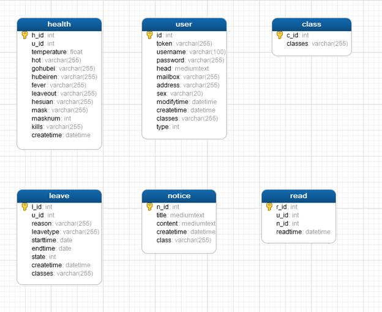

# #说明

> 本人疫情防控管理系统说明文档,纯手敲,别问为什么不直接用软件生成,问就是那时候不会
>
> 本人全部[`编程学习笔记分享`](https://gitee.com/hongjilin/hongs-study-notes),里面记录本人毕生所学--前后端编程学习、算法、软件破解之类的的都记录进去了。传到了git上,需要的自取,持续更新,觉得好的给个``star`谢谢

# #目录

>[TOC]

# 疫情项目API接口文档(洪吉林)

## 1.1. API  接口说明(后期补充)

- 接口基准地址：`192.168.0.22/` -->根据自己需求更改,自己本机电脑就`http://localhost:...`
- 数据返回格式统一使用 JSON (如有其他格式将在接口文档声明)

### 1.1.1. 支持的请求方法

- POST
- GET

### 1.1.2. 通用返回状态说明

| *状态码* | *含义*                | *说明*           |
| -------- | --------------------- | ---------------- |
| 200      | OK                    | 请求成功         |
| 404      | NOT FOUND             | 请求的资源不存在 |
| 500      | INTERNAL SERVER ERROR | 内部服务端错误   |

## 1.2. 数据库 设计 

>数据库名 : vue_store
>
>数据库账号 : root
>
>数据库密码 : root
>
>数据库 :utf8  排序规则 :utf8_unicode_ci
>
>

### 1.2.1.用户表

| *字段名*         | *含义*                            | 数据类型   | *说明*            |
| ---------------- | --------------------------------- | ---------- | ----------------- |
| id               | 用户id(学号或者教师号)            | int        | 必填              |
| <u>*token*</u>   | 加密后的数据                      | varchar    | (可不使用)        |
| username         | 用户                              | varchar    | 必填              |
| password         | 密码                              | varchar    | 必填              |
| *<u>head</u>*    | 头像缩略图                        | mediumtext | (可不使用)        |
| *<u>mailbox</u>* | 邮箱                              | varchar    | (可不使用)        |
| address          | 地址籍贯                          | varchar    | 可不填            |
| sex              | 性别                              | varchar    | 必填              |
| createtime       | 用户创建时间                      | datetime   | CURRENT_TIMESTAMP |
| modifytime       | 最近一次修改时间                  | datetime   | CURRENT_TIMESTAMP |
| classes          | 所属班级(教师也要,可以填多个班级) | varchar    | 必填              |
| type             | 类型(1管理员 2学生  3教师)        | int        | 必填              |


### 1.2.2.健康填报表

| *字段名*    | *含义*           | 数据类型 | *说明*    (是  否) |
| ----------- | ---------------- | -------- | ------------------ |
| h_id        | 健康表id         | int      | 必填               |
| u_id        | 用户id           | int      | 必填               |
| temperature | 当前体温         | float    | 必填               |
| hot         | 是否发热         | varchar  | 必填               |
| gohubei     | 是否去过湖北     | varchar  | 必填               |
| hubeiren    | 是否是湖北籍贯   | varchar  | 必填               |
| fever       | 是否发热         | varchar  | 必填               |
| leaveout    | 是否离开学校     | varchar  | 必填               |
| hesuan      | 是否经过核酸检测 | varchar  | 必填               |
| mask        | 口罩是否充足     | varchar  | 必填               |
| masknum     | 口罩剩余数量     | int      | 必填               |
| kills       | 杀毒用品是否充足 | varchar  | 必填               |
| createtime  | 健康表创建时间   | datetime | CURRENT_TIMESTAMP  |


### 1.2.3 请假表

| *字段名*   | *含义*                                                       | 数据类型 | *说明*                   |
| ---------- | ------------------------------------------------------------ | -------- | ------------------------ |
| l_id       | 请假表id                                                     | int      | 必填                     |
| u_id       | 请假人的id                                                   | int      | 必填                     |
| reason     | 请假理由                                                     | varchar  | 必填                     |
| leavetype  | 请假类型(外出 or 病假)                                       | varchar  | 必填                     |
| starttime  | 请假开始时间                                                 | date     | 必填 (格式 : 2020-08-25) |
| endtime    | 请假结束时间                                                 | date     | 必填 (格式 : 2020-08-26) |
| state      | 审批状态( 0未审批    or     1审批不通过      or   2审批通过 ) | int      | 必填                     |
| createtime | 创建时间                                                     | datetime | CURRENT_TIMESTAMP        |
| classes    | 所在的班级                                                   | varchar  | 必填                     |

### 1.2.4公告表

| *字段名*         | *含义*               | 数据类型   | *说明*                      |
| ---------------- | -------------------- | ---------- | --------------------------- |
| l_id             | 公告id               | int        | 必填                        |
| title            | 公告标题             | mediumtext | 必填                        |
| <u>*content*</u> | 公告内容             | mediumtext | (可不使用)                  |
| createtime       | 创建时间             | datetime   | 必填                        |
| class            | 通知的班级集合字符串 | varchar    | 必填 (可以填多个,以 ; 分隔) |


### 1.2.5阅读表-略

### 1.2.6 班级表-略


## 1.3. 共有部分

### 1.3.1. 登录验证接口

- 请求路径：/users/login
- 请求方法：post
- 请求参数

| 参数名   | 参数说明 | 数据类型 | 备注                   |
| -------- | -------- | -------- | ---------------------- |
| username | 用户名   | varchar  | 不能为空               |
| password | 密码     | varchar  | 不能为空               |
| type     | 用户类型 | int      | (1管理员 2学生 3教师 ) |

- 响应参数(如果无此用户将无数据)

| 参数名   | 参数说明 | 备注 |
| -------- | -------- | ---- |
| id       | 用户 ID  |      |
| username | 用户名   |      |
| password | 密码     |      |

### 1.3.2. 个人信息管理  

#### 1.3.2.1.个人信息获取

- 请求路径：/users/getUserDataById
- 请求方法：get
- 请求参数

| 参数名 | 参数说明 | 数据类型 | 备注 |
| ------ | -------- | -------- | ---- |
| u_id   | 用户id   | int      |      |

- 响应参数(如果无此用户将无数据)

| 参数名     | 参数说明           | 数据类型 | 备注                   |
| ---------- | ------------------ | -------- | ---------------------- |
| id         | 用户 ID            | int      |                        |
| username   | 用户名             | varchar  |                        |
| classes    | 所属班级           | varchar  |                        |
| sex        | 性别               | varchar  |                        |
| address    | 地址籍贯或者生源地 | varchar  |                        |
| createtime | 入网时间           | date     |                        |
| modifytime | 最近一次修改时间   | datetime | CURRENT_TIMESTAMP      |
| type       | 身份类型           | int      | (1管理员 2学生 3教师 ) |

#### 1.3.2.2. 个人密码修改

- 请求路径：/users/upPwd
- 请求方法：post
- 请求参数

| 参数名      | 参数说明 | 数据类型 | 备注           |
| ----------- | -------- | -------- | -------------- |
| u_id        | 用户id   | int      |                |
| oldpassword | 旧密码   | varchar  |                |
| newpassword | 新密码   | varchar  | (密码长度6-16) |

- 响应参数

| 参数名  | 参数说明     | 数据类型 | 备注 |
| ------- | ------------ | -------- | ---- |
| results | 成功或者失败 | varchar  |      |


### 1.3.3.  发布通知

- 请求路径：/admin/announce
- 请求方法：post
- 请求参数

| 参数名  | 参数说明   | 数据类型 | 备注                           |
| ------- | ---------- | -------- | ------------------------------ |
| title   | 标题       | text     |                                |
| classes | 班级字符串 | varchar  | 多个班级以;分隔  (3班;5班;1班) |

- 响应参数

| 参数名  | 参数说明     | 数据类型 | 备注 |
| ------- | ------------ | -------- | ---- |
| results | 成功或者失败 | varchar  |      |

### 1.3.4 获取所有通知与数量(分页获取)

- 请求路径：/admin/getAllNotice
- 请求方法：get
- 请求参数

| 参数名   | 参数说明     | 数据类型 | 备注 |
| -------- | ------------ | -------- | ---- |
| pageNum  | 每页几条数据 | int      |      |
| currPage | 当前页面     | int      |      |

- 响应参数

| 参数名 | 参数说明       | 数据类型 | 备注 |
| ------ | -------------- | -------- | ---- |
| data   | 当前页用户数据 | json     |      |
| total  | 用户总页数     | int      |      |

## 1.4. 学生管理

### 1.4.1.健康上报

#### 1.4.1.1. 个人信息获取(见共有部分)

#### 1.4.1.2. 健康填报表

> 前端先获取该用户当天填报表,如果没有才可以填写

- 请求路径：/students/sethealth
- 请求方法：post
- 请求参数

| *参数*      | *含义*           | 数据类型 | *说明*    (是  否)                |
| ----------- | ---------------- | -------- | --------------------------------- |
| h_id        | 健康表id         | int      | (自动生成不用填写)                |
| u_id        | 用户id           | int      | 必填                              |
| temperature | 当前体温         | float    | 必填                              |
| hot         | 是否发热         | varchar  | 必填                              |
| gohubei     | 是否去过湖北     | varchar  | 必填                              |
| hubeiren    | 是否是湖北籍贯   | varchar  | 必填                              |
| fever       | 是否发热         | varchar  | 必填                              |
| leave       | 是否离开学校     | varchar  | 必填                              |
| hesuan      | 是否经过核酸检测 | varchar  | 必填                              |
| mask        | 口罩是否充足     | varchar  | 必填                              |
| masknum     | 口罩剩余数量     | int      | 必填                              |
| kill        | 杀毒用品是否充足 | varchar  | 必填                              |
| createtime  | 健康表创建时间   | atetime  | CURRENT_TIMESTAMP<br />(自动生成) |

- 响应参数

| 参数名 | 参数说明     | 数据类型 | 备注 |
| ------ | ------------ | -------- | ---- |
| data   | 成功或者失败 | json     |      |

#### 1.4.1.3 获取当天所有填报表

> 获取的是

- 请求路径：/students/gethealthNowDay
- 请求方法：get
- 请求参数 -无参数

- 响应参数

| 参数名 | 参数说明         | 数据类型 | 备注 |
| ------ | ---------------- | -------- | ---- |
| list   | 当天所有报表信息 |          |      |

#### 1.4.1.4 获取当天所有填报表与总数量(分页获取)

> 获取的是

- 请求路径：/students/gethealthNowDayPage
- 请求方法：get
- 请求参数 

| 参数名   | 参数说明     | 数据类型 | 备注 |
| -------- | ------------ | -------- | ---- |
| pageNum  | 每页几条数据 | int      |      |
| currPage | 当前页面     | int      |      |

- 响应参数

| 参数名 | 参数说明       | 数据类型 | 备注 |
| ------ | -------------- | -------- | ---- |
| data   | 当前页用户数据 | json     |      |
| total  | 用户总页数     | int      |      |

#### 1.4.1.5. 获取当天某用户报表

- 请求路径：/students/getHealthNowDayByid
- 请求方法：get
- 请求参数 

| 参数名 | 参数说明         | 数据类型 | 备注 |
| ------ | ---------------- | -------- | ---- |
| u_id   | 用来获取的用户id | int      | 必填 |

- 响应参数

| 参数名 | 参数说明       | 数据类型 | 备注 |
| ------ | -------------- | -------- | ---- |
| data   | 当前页用户数据 | json     |      |

#### 1.4.1.6 获取所有报表

- 请求路径：/students/getAllHealth
- 请求方法：get
- 请求参数 -无参数

- 响应参数

| 参数名 | 参数说明     | 数据类型 | 备注 |
| ------ | ------------ | -------- | ---- |
| data   | 所有报表信息 |          |      |

### 1.4.2.  请假申请

- 请求路径：/students/setLeave
- 请求方法：post
- 请求参数

| 参数名    | 参数说明 | 数据类型 | 备注                     |
| --------- | -------- | -------- | ------------------------ |
| u_id      | 用户 ID  | int      | 必填                     |
| reason    | 请假理由 | varchar  | 必填                     |
| leavetype | 请假类型 | varchar  | 必填(病假或者外出)       |
| starttime | 开始时间 | date     | 必填 (格式 : 2020-08-25) |
| endtime   | 结束时间 | date     | 必填 (格式 : 2020-08-25) |

- 响应参数

| 参数名  | 参数说明         | 数据类型 | 备注     |
| ------- | ---------------- | -------- | -------- |
| results | 提交成功或者失败 | varchar  | 提交结果 |


### 1.4.3. 我的通知

#### 1.4.3.1. 我的通知分页获取数据与数量

- 请求路径：/students/getNotice
- 请求方法：get
- 请求参数

| 参数名   | 参数说明     | 数据类型 | 备注 |
| -------- | ------------ | -------- | ---- |
| u_id     | 当前用户id   | int      | 必填 |
| pageNum  | 每页几条数据 | int      |      |
| currPage | 当前页面     | int      |      |

- 响应参数

- 响应参数

| 参数名 | 参数说明       | 数据类型 | 备注 |
| ------ | -------------- | -------- | ---- |
| data   | 当前页用户数据 | json     |      |
| total  | 用户总页数     | int      |      |

#### 1.4.3.2. 我的通知修改(已读未读)

##### 1.4.3.2.1 获取的我通知已读列表(供已读未读状态渲染)

- 请求路径：/students/getNoticeRead
- 请求方法：get
- 请求参数

| 参数名 | 参数说明   | 数据类型 | 备注 |
| ------ | ---------- | -------- | ---- |
| u_id   | 当前用户id | int      | 必传 |

- ###### 响应参数

| 参数名       | 参数说明                   | 数据类型 | 备注 |
| ------------ | -------------------------- | -------- | ---- |
| `list`       | 包含下面几个参数的对象集合 |          |      |
| n_id         | 公告id                     | int      |      |
| **u_id**     | 用户id                     | int      |      |
| **readtime** | 阅读时间                   | datetime |      |

##### 1.4.3.2.2 已读转未读

- 请求路径：/students/goweidu
- 请求方法：get
- 请求参数

| 参数名 | 参数说明 | 数据类型 | 备注               |
| ------ | -------- | -------- | ------------------ |
| n_id   | 公告id   | int      | (点击的当前公告id) |
| u_id   | 用户id   | int      | 当前登录用户       |

- 响应参数

| 参数名  | 参数说明     | 数据类型 | 备注     |
| ------- | ------------ | -------- | -------- |
| results | 成功或者失败 | varchar  | 删除结果 |

##### 1.4.3.2.3 未读转已读

- 请求路径：/students/goyidu
- 请求方法：get
- 请求参数

| 参数名 | 参数说明   | 数据类型 | 备注               |
| ------ | ---------- | -------- | ------------------ |
| n_id   | 公告id     | int      | (点击的当前公告id) |
| u_id   | 当前用户id | int      | 当前登录用户       |

- 响应参数

| 参数名  | 参数说明     | 数据类型 | 备注     |
| ------- | ------------ | -------- | -------- |
| results | 成功或者失败 | varchar  | 修改结果 |

## 1.5. 管理员

### 1.5.1. 根据用户类型进行用户信息与数量获取

##### 1.5.1.1 根据用户类型进行用户信息获取(分页获取总数量与数据)

> 管理员用户管理部分可进行两次查询,一次教师获取一次学生获取  可以做到教师管理与学生管理分开

- 请求路径：/users/getUsersByTypePage
- 请求方法：get
- 请求参数

| 参数名   | 参数说明                    | 数据类型 | 备注 |
| -------- | --------------------------- | -------- | ---- |
| type     | 用户类型(1管理员2学生3教师) | int      |      |
| pageNum  | 每页几条数据                | int      |      |
| currPage | 当前页面                    | int      |      |

- 响应参数(若无此类型用户   无返回)

| 参数名 | 参数说明       | 数据类型 | 备注 |
| ------ | -------------- | -------- | ---- |
| data   | 当前页用户数据 | json     |      |
| total  | 用户总页数     | int      |      |

##### 1.5.1.2. 根据用户类型与查询字段模糊查询 (数据与总数量返回)

- 请求路径：/admin/getUsersByTypeAndChar
- 请求方法：get
- 请求参数

| 参数名    | 参数说明                                                     | 数据类型 | 备注 |
| --------- | ------------------------------------------------------------ | -------- | ---- |
| type      | 用户类型(1管理员2学生3教师)                                  | int      |      |
| inputText | 输入的内容                                                   | varchar  |      |
| CharType  | 查询的字段(籍贯: address      用户名: username     <br />学号: id  班级:  classes  ) | varchar  |      |
| pageNum   | 每页几条数据                                                 | int      |      |
| currPage  | 当前页面                                                     | int      |      |

- 响应参数(若无此类型用户  无返回)

| 参数名 | 参数说明       | 数据类型 | 备注 |
| ------ | -------------- | -------- | ---- |
| data   | 当前页用户数据 | json     |      |
| total  | 用户总页数     | int      |      |

##### 

### 1.5.2. 所有用户信息获取  

##### 1.5.2.1.所有用户信息获取与数量 (分页获取) 

> 管理员用户管理部分可进行两次查询,一次教师获取一次学生获取  可以做到教师管理与学生管理分开

- 请求路径：/users/getAllUsers
- 请求方法：get
- 请求参数  

| 参数名   | 参数说明     | 数据类型 | 备注 |
| -------- | ------------ | -------- | ---- |
| pageNum  | 每页几条数据 | int      |      |
| currPage | 当前页面     | int      |      |

- 响应参数(若无此类型用户返回  无返回)

| 参数名 | 参数说明       | 数据类型 | 备注 |
| ------ | -------------- | -------- | ---- |
| data   | 当前页用户数据 | json     |      |
| total  | 用户总页数     | int      |      |

### 1.5.3. 用户文件导入(导入后需要调用用户增加接口写入)   

- 请求路径：/upload/upload
- 请求方式 : form表单提交

```html
<form action="/upload/upload" enctype="multipart/form-data" method="post">
    <input type="text" name="title"><br>
    <input type="file" name="upload" multiple="multiple"><br>
    <input type="submit" value="Upload">
    </form>
```

- ###### 响应参数

| 参数名  | 参数说明     | 数据类型 | 备注 |
| ------- | ------------ | -------- | ---- |
| results | 成功或者失败 | varchar  |      |


### 1.5.4. 用户增删改

#### 1.5.4.1. 用户增加 -需要导入文件后再调用以写入数据库

> 如果id重复就进行更新,不重复插入

- 请求路径：/users/setXlsxData
- 请求方法：post
- 请求参数   无参直接调用

- 响应参数

| 参数名  | 参数说明                                                     | 数据类型 | 备注 |
| ------- | ------------------------------------------------------------ | -------- | ---- |
| results | 通过redis数据库内缓存的xlsx数据<br />读取写入数据库,若无返回未导入文件<br />缓存数据存在3600秒 | varchar  |      |

#### 1.5.4.2. 用户删除)(同时清空该用户阅读记录)

> 默认u_id==0为管理员 不能删除

- 请求路径：/users/delUserdata
- 请求方法：get
- 请求参数

| 参数名 | 参数说明 | 数据类型 | 备注               |
| ------ | -------- | -------- | ------------------ |
| u_id   | 用户id   | int      | (点击的当前用户id) |

- 响应参数

| 参数名  | 参数说明     | 数据类型 | 备注     |
| ------- | ------------ | -------- | -------- |
| results | 成功或者失败 | varchar  | 删除结果 |


#### 1.5.4.3. 用户修改

- 请求路径：/users/upUserdata
- 请求方法：post
- 请求参数

| 参数名   | 参数说明       | 数据类型 | 备注(都是必传)              |
| -------- | -------------- | -------- | --------------------------- |
| u_id     | 用户id         | int      | (点击的当前用户id)          |
| username | 用户名         | varchar  |                             |
| sex      | 性别           | varchar  |                             |
| address  | 籍贯地址生源地 | varchar  |                             |
| type     | 修改用户类型   | int      | 类型(1管理员 2学生 3教师  ) |

- 响应参数

| 参数名  | 参数说明     | 数据类型 | 备注     |
| ------- | ------------ | -------- | -------- |
| results | 成功或者失败 | varchar  | 修改结果 |

##### 1.5.3.4. 用户头像修改

- 请求路径：/users/upicon
- 请求方法：post
- 请求参数

| 参数名 | 参数说明 | 数据类型 | 备注(都是必传)     |
| ------ | -------- | -------- | ------------------ |
| u_id   | 用户id   | int      | (点击的当前用户id) |

- 响应参数

| 参数名  | 参数说明     | 数据类型 | 备注     |
| ------- | ------------ | -------- | -------- |
| results | 成功或者失败 | varchar  | 上传结果 |


## 1.6. 教师管理

### 1.6.1.请假审批

#### 1.6.1.1. 获取该用户所属班级的全部请假单与数量(分页查询)

- 请求路径：/admin/getLeave
- 请求方法：get
- 请求参数

| 参数名   | 参数说明 | 数据类型 | 备注 |
| -------- | -------- | -------- | ---- |
| u_id     | 用户id   | int      |      |
| currPage | 当前页数 | int      |      |
| pageNum  | 每页数量 | int      |      |

- 响应参数

| 参数名 | 参数说明       | 数据类型 | 备注 |
| ------ | -------------- | -------- | ---- |
| data   | 当前页用户数据 | json     |      |
| total  | 用户总页数     | int      |      |


#### 1.6.1.. 获取该用户请假审批与数量(分页)

- 请求路径：/admin/getuserLeave
- 请求方法：get
- 请求参数

| 参数名   | 参数说明 | 数据类型 | 备注 |
| -------- | -------- | -------- | ---- |
| u_id     | 用户id   | int      |      |
| currPage | 当前页数 | int      |      |
| pageNum  | 每页数量 | int      |      |

- 响应参数

| 参数名 | 参数说明       | 数据类型 | 备注 |
| ------ | -------------- | -------- | ---- |
| data   | 当前页用户数据 | json     |      |
| total  | 用户总页数     | int      |      |

#### 1.6.1.3. 当前请假单审批(修改审批状态)

- 请求路径：/admin/upLeaveState
- 请求方法：get
- 请求参数

| 参数名  | 参数说明     | 数据类型 | 备注                                                  |
| ------- | ------------ | -------- | ----------------------------------------------------- |
| l_id    | 请假条id     | int      | 当前点击审批的请假条                                  |
| upState | 修改审批状态 | int      | ( 0未审批    or     1审批不通过      or   2审批通过 ) |

## 1.7. 增值功能

### 1.7.1. 当前公告查看详情

> 查询两张表

- 请求路径：/admin/NoticeDetails
- 请求方法：get
- 请求参数

| 参数名 | 参数说明 | 数据类型 | 备注           |
| ------ | -------- | -------- | -------------- |
| n_id   | 公告id   | int      | 当前点击公告id |

- 响应参数

| 参数名  | 参数说明                            | 数据类型 | 备注 |
| ------- | ----------------------------------- | -------- | ---- |
| readNum | 当前公告已读人数                    | int      |      |
| tatol   | 当前公告发布通知总人数              | int      |      |
| data    | 公告详情内容                        | json     |      |
| users   | 阅读的用户头像,名字以及班级以及时间 | json     |      |

### 1.7.2.当前 公告删除功能(同时清空该公告的被阅读记录)

> 删除两张表

- 请求路径：/admin/delNotice
- 请求方法：get
- 请求参数

| 参数名 | 参数说明 | 数据类型 | 备注           |
| ------ | -------- | -------- | -------------- |
| n_id   | 公告id   | int      | 当前点击公告id |

- 响应参数

| 参数名 | 参数说明 | 数据类型 | 备注 |
| ------ | -------- | -------- | ---- |
| result | 删除结果 | varchar  |      |

### 1.7.3. 添加班级或者专业

- 请求路径：/admin/addClasses
- 请求方法：get
- 请求参数

| 参数名  | 参数说明           | 数据类型 | 备注                             |
| ------- | ------------------ | -------- | -------------------------------- |
| Classes | 添加的班级或者专业 | varchar  | (不可以带 ; )(专业名长度不超过6) |

- 响应参数

| 参数名 | 参数说明 | 数据类型 | 备注 |
| ------ | -------- | -------- | ---- |
| result | 删除结果 | varchar  |      |

### 1.7.4. 获取班级或者专业

- 请求路径：/admin/getClasses
- 请求方法：get
- 请求参数

- 响应参数

| 参数名 | 参数说明       | 数据类型 | 备注 |
| ------ | -------------- | -------- | ---- |
| data   | 获取的班级数组 | array    |      |

### 1.7.5 模糊查询班级(分页获取数据与数量)

- 请求路径：/admin/getClassesSear
- 请求方法：get
- 请求参数

| 参数名    | 参数说明     | 数据类型 | 备注 |
| --------- | ------------ | -------- | ---- |
| inputText | 输入的内容   | varchar  |      |
| pageNum   | 每页几条数据 | int      |      |
| currPage  | 当前页面     | int      |      |

- 响应参数(若无此类型用户返回  无返回)

| 参数名 | 参数说明       | 数据类型 | 备注 |
| ------ | -------------- | -------- | ---- |
| data   | 当前页用户数据 | json     |      |
| total  | 用户总页数     | int      |      |


## 1.8. 数据库创建语句

> 本来我是懒得写这个,因为觉得给出了数据库er图应该大伙都可以自己写出来,但是好多人私信说不会创建数据库,想了一下那我就写出sql创建语句,正好也当锻炼一下自己.所以看到这里还不点个`star`是不是说不过去了:dog:
>
> 大家创建了``database`后,运行以下几个查询语句即可创建全部表,这饭都喂到嘴里了别说还不会了同学们,这都不会就说不过去了

### 1.8.1用户表结构创建sql语句

>```sql
>DROP TABLE IF EXISTS `user`;
>CREATE TABLE `user` (
>  `id` int(11) NOT NULL COMMENT '用户id',
>  `token` varchar(255) COLLATE utf8_unicode_ci DEFAULT NULL,
>  `username` varchar(100) COLLATE utf8_unicode_ci NOT NULL COMMENT '用户',
>  `password` varchar(255) COLLATE utf8_unicode_ci NOT NULL COMMENT '密码',
>  `head` mediumtext CHARACTER SET utf8 COMMENT '头像',
>  `mailbox` varchar(255) COLLATE utf8_unicode_ci DEFAULT NULL COMMENT '邮箱',
>  `address` varchar(255) CHARACTER SET utf8 DEFAULT NULL COMMENT '地址',
>  `sex` varchar(20) CHARACTER SET utf8 DEFAULT NULL COMMENT '性别',
>  `modifytime` datetime DEFAULT CURRENT_TIMESTAMP COMMENT '最近一次修改时间',
>  `createtime` datetime DEFAULT CURRENT_TIMESTAMP COMMENT '存入时间',
>  `classes` varchar(255) COLLATE utf8_unicode_ci DEFAULT NULL COMMENT '所属班级',
>  `type` int(11) NOT NULL,
>  PRIMARY KEY (`id`)
>) ENGINE=InnoDB DEFAULT CHARSET=utf8 COLLATE=utf8_unicode_ci;
>```

### 1.8.2 健康填报表结构创建sql语句

>```sql
>DROP TABLE IF EXISTS `health`;
>CREATE TABLE `health` (
>  `h_id` int(11) NOT NULL AUTO_INCREMENT COMMENT '健康表id',
>  `u_id` int(11) NOT NULL COMMENT '用户id',
>  `temperature` float(11,1) DEFAULT NULL COMMENT '当前体温',
>  `hot` varchar(255) COLLATE utf8_unicode_ci DEFAULT NULL COMMENT '是否发热',
>  `gohubei` varchar(255) COLLATE utf8_unicode_ci DEFAULT NULL COMMENT '是否去过湖北',
>  `hubeiren` varchar(255) COLLATE utf8_unicode_ci DEFAULT NULL COMMENT '是否是湖北籍贯',
>  `fever` varchar(255) COLLATE utf8_unicode_ci DEFAULT NULL COMMENT '是否发热',
>  `leaveout` varchar(255) COLLATE utf8_unicode_ci DEFAULT NULL COMMENT '是否离开学校',
>  `hesuan` varchar(255) COLLATE utf8_unicode_ci DEFAULT NULL COMMENT '是否经过核酸检测',
>  `mask` varchar(255) COLLATE utf8_unicode_ci DEFAULT NULL COMMENT '口罩是否充足',
>  `masknum` int(11) DEFAULT NULL COMMENT '口罩剩余数量',
>  `kills` varchar(255) COLLATE utf8_unicode_ci DEFAULT NULL COMMENT '杀毒用品是否充足',
>  `createtime` datetime DEFAULT CURRENT_TIMESTAMP COMMENT '存入时间',
>  PRIMARY KEY (`h_id`)
>) ENGINE=InnoDB AUTO_INCREMENT=26 DEFAULT CHARSET=utf8 COLLATE=utf8_unicode_ci;
>```

### 1.8.3 请假表结构创建sql语句

>```sql
>DROP TABLE IF EXISTS `leave`;
>CREATE TABLE `leave` (
>  `l_id` int(11) NOT NULL AUTO_INCREMENT COMMENT '请假表id -创建时间+学号',
>  `u_id` int(11) NOT NULL COMMENT '请假人的id',
>  `reason` varchar(255) COLLATE utf8_unicode_ci DEFAULT NULL COMMENT '请假理由',
>  `leavetype` varchar(255) COLLATE utf8_unicode_ci DEFAULT NULL COMMENT '请假类型',
>  `starttime` date DEFAULT NULL COMMENT '请假开始时间',
>  `endtime` date DEFAULT NULL COMMENT '请假结束时间',
>  `state` int(11) DEFAULT '0' COMMENT '审批状态',
>  `createtime` datetime DEFAULT CURRENT_TIMESTAMP COMMENT '创建时间',
>  `classes` varchar(255) COLLATE utf8_unicode_ci DEFAULT NULL COMMENT '所在的班级',
>  PRIMARY KEY (`l_id`)
>) ENGINE=InnoDB AUTO_INCREMENT=34 DEFAULT CHARSET=utf8 COLLATE=utf8_unicode_ci;
>```

### 1.8.4 公告表结构创建sql语句

>```sql
>DROP TABLE IF EXISTS `notice`;
>CREATE TABLE `notice` (
>  `n_id` int(11) NOT NULL AUTO_INCREMENT COMMENT '公告id',
>  `title` mediumtext COLLATE utf8_unicode_ci COMMENT '公告标题',
>  `content` mediumtext COLLATE utf8_unicode_ci,
>  `createtime` datetime DEFAULT CURRENT_TIMESTAMP COMMENT '创建时间',
>  `class` varchar(255) COLLATE utf8_unicode_ci DEFAULT NULL COMMENT '通知的班级',
>  PRIMARY KEY (`n_id`)
>) ENGINE=InnoDB AUTO_INCREMENT=36 DEFAULT CHARSET=utf8 COLLATE=utf8_unicode_ci;
>```

### 1.8.5 阅读表结构创建sql语句

>```sql
>DROP TABLE IF EXISTS `read`;
>CREATE TABLE `read` (
>  `r_id` int(11) NOT NULL AUTO_INCREMENT,
>  `u_id` int(11) NOT NULL,
>  `n_id` int(11) DEFAULT NULL,
>  `readtime` datetime DEFAULT CURRENT_TIMESTAMP COMMENT '已读时间',
>  PRIMARY KEY (`r_id`)
>) ENGINE=InnoDB AUTO_INCREMENT=148 DEFAULT CHARSET=utf8 COLLATE=utf8_unicode_ci;
>```

### 1.8.6 班级表结构创建sql语句

>```sql
>DROP TABLE IF EXISTS `class`;
>CREATE TABLE `class` (
>  `c_id` int(11) NOT NULL AUTO_INCREMENT,
>  `classes` varchar(255) COLLATE utf8_unicode_ci NOT NULL,
>  PRIMARY KEY (`c_id`)
>) ENGINE=InnoDB AUTO_INCREMENT=17 DEFAULT CHARSET=utf8 COLLATE=utf8_unicode_ci;
>```


